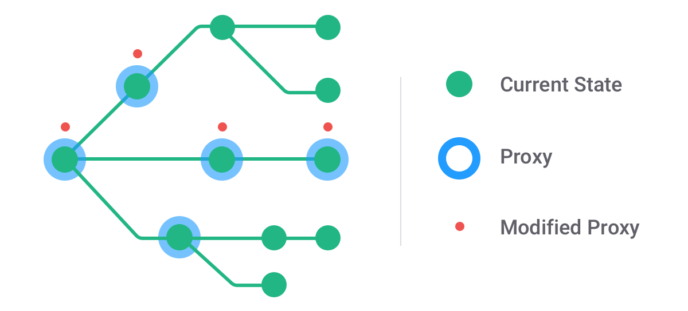
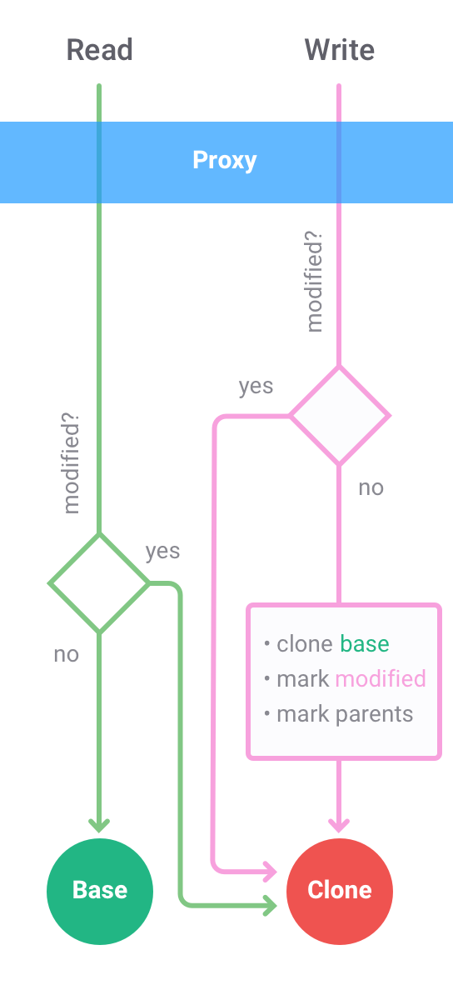

# Immer 是如何运作的？

Well, two words; 1) Copy-on-write. 2). Proxies. Let me draw a picture.

其实就两个字： 1）写时复制。2）代理。让我画一幅画告诉你：

The green tree is the original state tree. You will note that some circles in the green tree have a blue border around them. These are called proxies. Initially, when the producer starts, there is only one such proxy. It is the draft object that get’s passed into your function. Whenever you read any non-primitive value from that first proxy, it will in turn create a Proxy for that value. So that means that you end up with a proxy tree, that kind of overlays (or shadows) the original base tree. Yet, only the parts you have visited in the producer so far.

绿色的树是原始的状态树。 您会注意到绿色的树中的某些圆圈周围有蓝色边框。 这些被称为代理。 最初，当 producer 函数启开始运行时，只有一个这样的代理。它就是 draft 对象，它作为参数被传递到你的 producer 函数中。每当您从该第一个代理读取任何非原始值时，它将依次为该值创建代理。这意味着你最终会得到一个代理树，即原始基树的那种覆盖（或阴影）。 也就是说，到目前为止，只有您在 producer 中访问过的部分才会变成代理。

Now, as soon as you try to change something on a proxy (directly or through any API), it will immediately create a shallow copy of the node in the source tree it is related to, and sets a flag “modified”. From now on, any future read and write to that proxy will not end up in the source tree, but in the copy. Also, any parent that was unmodified so far will be marked “modified”.
When the producer finally ends, it will just walk through the proxy tree, and, if a proxy is modified, take the copy; or, if not modified, simply return the original node. This process results in a tree that is structurally shared with the previous state. And that is basically all there is to it.

现在，只要您尝试在代理上（直接或通过任何 API）更改某些内容，它就会立即在与其相关的源树中创建节点的浅拷贝，并设置标记 “modified”。 从现在开始，对该代理的任何未来读取和写入都不会在源代码树中结束，而是在副本中结束。 此外，到目前为止未修改的任何父级都将被标记为“已修改”。
当 producer 函数最终结束时，它将遍历代理树，并且，如果代理被修改，则取副本; 或者，如果没有修改，只需返回原始节点。 此过程导致树在结构上与先前状态共享。 这基本上就是它的全部内容。